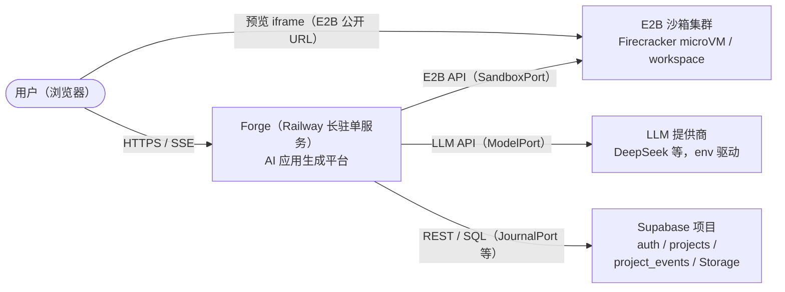
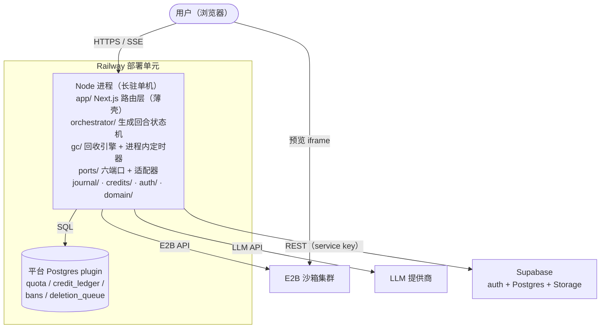
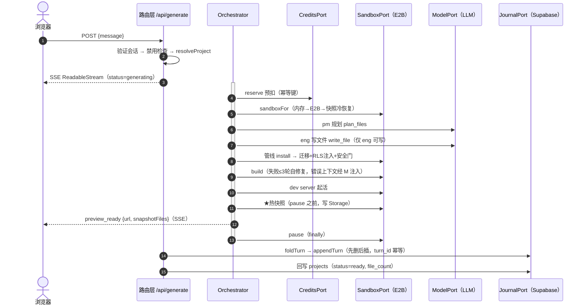

# 05 — Forge 架构设计（As-Built）

| 项 | 值 |
|---|---|
| 版本 | 1.0（2026-09-19，随持久化落地后整理） |
| 状态 | 现行架构，**取代 `archive/03-architecture-v1.md` 的旧设计**（k8s / 容器 / namespace 等词已废弃，见 CONTEXT.md） |
| 记法 | C4 模型（上下文/容器/模块）+ 时序图，Mermaid；章节组织对齐 arc42 |
| 范围 | 用户可见系统边界之内；领域词汇以 CONTEXT.md 为准 |
| 依据 | 代码现状逐文件核对；关键决策可追溯至 docs/04 与 tickets（.scratch/issues/） |

---

## 1. 系统概述

Forge 是一个 AI 应用生成平台：用户用自然语言描述需求，多 agent 团队（产品层的 Mike/Emma/Alex 拟人化包装）在沙箱里生成一个可预览的 React 应用。

**核心承诺**（本架构必须保证的四条产品不变量）：

1. 匿名可试用，升级可保身（身份 ID 不变，资产归属不变）；
2. 刷新不丢对话（对话是后端持久资产）；
3. 沙箱死亡应用还在（产物有独立于沙箱的持久副本）；
4. 登录后找回同一个工作区（对话 + 产物 + 预览）。

## 2. 架构风格与总体决策

| 决策 | 选择 | 理由 | 出处 |
|---|---|---|---|
| 运行时形态 | **长驻单机**：Railway 上一个 Node 进程同时跑 Next.js + orchestrator + GC 定时器 | SSE 继承函数时长限制（Vercel 300s 硬上限），完整生成链 1–3 分钟起 | ticket 14 |
| 计算与存储 | **无状态计算层 + 每类数据唯一真相**：进程可随时死，真相在 Postgres / Storage | 微服务思想，不拆拓扑 | docs/04 §2 |
| 状态管理 | 对话 = **WAL**（追加日志）；产物 = **checkpoint**（latest-wins 快照）；进程内 Map 仅缓存 | 两类资产时间语义不同 | docs/04 |
| 执行隔离 | 每个 workspace 一个 **E2B Firecracker microVM**，`metadata.workspace_id` 标记 | 生成代码不可信，必须机检隔离 | ticket 12 |
| 依赖方向 | orchestrator 只见 **port**，不见 SDK（SandboxPort / ModelPort / CreditsPort / GatePort / JournalPort / SnapshotPort） | 可测性；实现可换 | 代码 |
| 持久化写路径 | 路由 = 命令编排 + tee；**快照在 orchestrator 管线内、pause 之前的热沙箱上执行** | 路由侧 save 与 pause 竞争会无限挂起（e2e 实证） | docs/04 §3.3 |

## 3. 系统上下文（C4-L1）



外部依赖均经 port 隔离；LLM 协议 OpenAI/Anthropic 双兼容（`llm-model-adapter`）。

### 3.1 容器视图（C4-L2）



单进程内无进程间通信边界——这是长驻单机决策的直接结果，升级路径见 §8。

## 4. 模块视图（C4-L3，映射到 src/）

```
src/
├─ app/                        Next.js 路由层（命令编排，薄壳）
│  ├─ api/generate/            ★核心命令：身份→项目解析→orchestrator 流→journal tee
│  ├─ api/auth/*               匿名/OTP/magic-link/升级/会话（otp 判定核抽为纯函数）
│  ├─ api/projects/*           CRUD + /events 重放（属主校验在路由）
│  ├─ api/{preview,files,export,workspace}/  沙箱只读视图 / GC 入口
│  └─ page.tsx + components/workspace.tsx    唯一重客户端组件（对话/预览/代码面板）
├─ orchestrator/orchestrator.ts  生成回合状态机（单写者队列、首回合/迭代、
│                                自修复≤3轮、管线 install→migrate→gate→build→dev）
├─ domain/                     ForgeEvent(持久)/TransientEvent(不持久) 联合、角色
├─ journal/                    fold(纯折叠) + supabase 适配器
├─ ports/                      全部六端口 + E2B/LLM/快照适配器
├─ auth/                       session 验证器、otp.ts(FP核)、turnstile、captcha
├─ credits/                    预扣+结算两阶段记账（幂等键）、route 绑定
├─ gc/                         依赖序回收引擎 + 生产 deleters + 进程内定时器
├─ transport/                  SSE 线格式编码（纯函数）+ 零依赖 zip 导出
├─ lib/ · components/          supabase 客户端 / ui 原语（workspace.tsx 见上）
└─ backend/supabase-gate.ts    安全门（RLS 模板注入 + 扫描）
```

**分层规则**：`domain` 不依赖任何层；`orchestrator/journal` 只依赖 `ports`；`app` 依赖一切但不含业务判定（OTP 判定、快照过滤等纯逻辑均已下沉）。

## 5. 关键运行时场景

### 5.1 生成回合（核心写路径）



**单写者**：`runQueue` 按会话串行化并发回合（双开标签页排队）。

### 5.2 刷新水合（对话读路径）

```
页面挂载 → 身份解析(/api/auth/me 或匿名流) → restoreWorkspace(/api/preview)
        → GET /api/projects(取最近) → GET /api/projects/:id/events?after=seq
        → recordsToMessages() 重建与直播流相同的 Message 结构
```

### 5.3 冷恢复（产物读路径）

`sandboxFor()` 三级降级：内存 Map → `findSandbox(E2B)` → **快照恢复**（写回文件树 + 重建 manifest，迭代回合即见当前代码）→ 全新首回合。

### 5.4 登录找回

匿名生成 → `POST /api/auth/upgrade`（同 user id 加邮箱密码）→ 清环境 → magic link 重登 → 5.2 + 5.3 双水合。

### 5.5 GC（回收路径）

事件驱动（删除项目）+ 每日 cron 兜底（进程内定时器）→ `deletion_queue` 两阶段状态机 → 按依赖序执行五目标：`sandbox → storage_objects → supabase_rows → forge_rows → auth_user`，失败指数退避，5 次转 failed。

## 6. 数据架构

| 存储 | 数据 | 生命周期 |
|---|---|---|
| Supabase Postgres `projects` | 项目元数据（status/file_count） | 软删 archived；随用户 GC |
| Supabase Postgres `project_events` | 对话 WAL（seq 游标 + turn_id 幂等键） | 级联删除 |
| Supabase Storage `project-snapshots` 桶 | 产物快照 JSON（workspace 命名，latest-wins） | storage_objects GC 目标 |
| 平台 Postgres `quota/credit_ledger/bans` | 额度两阶段记账（按日重置） | forge_rows GC 目标 |
| 平台 Postgres `deletion_queue` | GC 持久队列 | 完成后保留为审计记录 |
| E2B 沙箱文件系统 | **唯一执行副本**（非持久层） | 14 天无访问回收 |
| 进程内 Map（sandbox/planned/interrupted/manifest） | 回合语义缓存 | 进程重启即失，靠 5.3 重建 |

**持久化边界**：dev 会话（无 Supabase 身份）不持久化；TransientEvent（run_step/plan_ready/…）按契约永不落库。

## 7. 安全设计

- **身份**：httpOnly `forge_session` cookie；服务端验证（DevVerifier 仅在无平台配置时激活）；匿名 JWT `is_anonymous` 可无损升级。
- **数据隔离**：apps 表全部 RLS（用户只读自己）；事件写入仅 service key（客户端不可伪造）；路由层属主校验双保险。
- **沙箱隔离**：secret key 永不入沙箱（迁移服务端跑）；沙箱内只给 publishable 值；未来发布必须独立注册域（cookie 作用域硬约束，ticket 05/12）。
- **安全门**：迁移 SQL 先注入 RLS 模板再检查；门失败是**终止态**，不进自修复循环。
- **输入验证**：信任边界处全部校验（消息长度、OTP 六位/过期/次数核、升级邮箱/密码）。

## 8. 质量属性

**可靠性（故障表，docs/04 §4）**：进程重启丢缓存不丢数据；快照后沙箱死亡可恢复；回合中途崩溃最多丢该回合；Storage 失败下回合重打点。

**可扩展性边界**（单机天花板，均有升级路径）：
- 单进程 `runQueue` 是全局面；多副本需 per-project Postgres advisory lock；
- SSE 长连接数受单进程限制；
- 只读并发的真实上限受 LLM rate limit 而非 E2B（待实测，CONTEXT 待固化项）。

**可观测性**：结构化 console（export/快照计时）；无集中式日志/指标——当前为已接受缺口。

## 9. 测试架构（与架构决策一一对应）

| 层 | 锚定的风险 | 位置 |
|---|---|---|
| 纯函数单测 | 判定逻辑等价类/边界（fold、OTP 核、快照过滤、GC 顺序） | `test/*.test.ts`（110 用例） |
| 端口单测 | FakeSandbox/FakeModel/FakeCredits + 手写 PostgREST double（幂等/游标） | 同上 |
| e2e 验收 | schema 漂移、RLS、写入时序、UI 交互（AC1–AC3 + CRUD UI + 旅程） | `e2e/`（8 文件 15 用例，含 smoke/production 探针；真实 LLM/E2B 的用例**串行**——并行会撞限流） |
| live | 提示词漂移告警（真模型真计费） | `test/live.test.ts` |

## 10. 部署架构

Railway 单服务（`railway.json`）+ Postgres plugin + E2B/LLM/Supabase env 矩阵。
**发布检查单**：迁移须先于流量执行（`node scripts/apply-migration.mjs scripts/migrations/00N-*.sql`——005 漏跑已被 e2e 实证为承诺破裂点）。

## 11. 已知限制与技术债

- 流式中硬刷新丢在途半条消息（升级路径：SSE `Last-Event-ID` + seq 续传）；
- 快照 latest-wins：失败回合产物不进快照；无版本化（回滚功能未做）；
- ~~project_files 未使用~~ 已成为快照镜像的 manifest（syncProjectFiles，详情页消费）；多项目落地时需重估 workspace↔project 键映射；
- 滥用检测、出站控制与配额、supervisor 分歧检测：**待固化**（CONTEXT.md）；
- 每回合全量读树打点：产物规模大后应增量；
- 匿名身份依赖 localStorage 持有的 Supabase 会话，清缓存即丢（升级是唯一保存路径——产品决策）。

## 12. 决策记录索引

硬性决策以 CONTEXT.md 词汇表 + docs/04 为权威；本文仅作架构聚合。关键 ADR 主题：长驻单机（ticket 14）、E2B 而非自建容器（12）、匿名优先（07/11）、GC 自建（12/13）、WAL+checkpoint 持久化（docs/04）、热快照消除 pause 竞争（docs/04 §7 实现纪要）。
