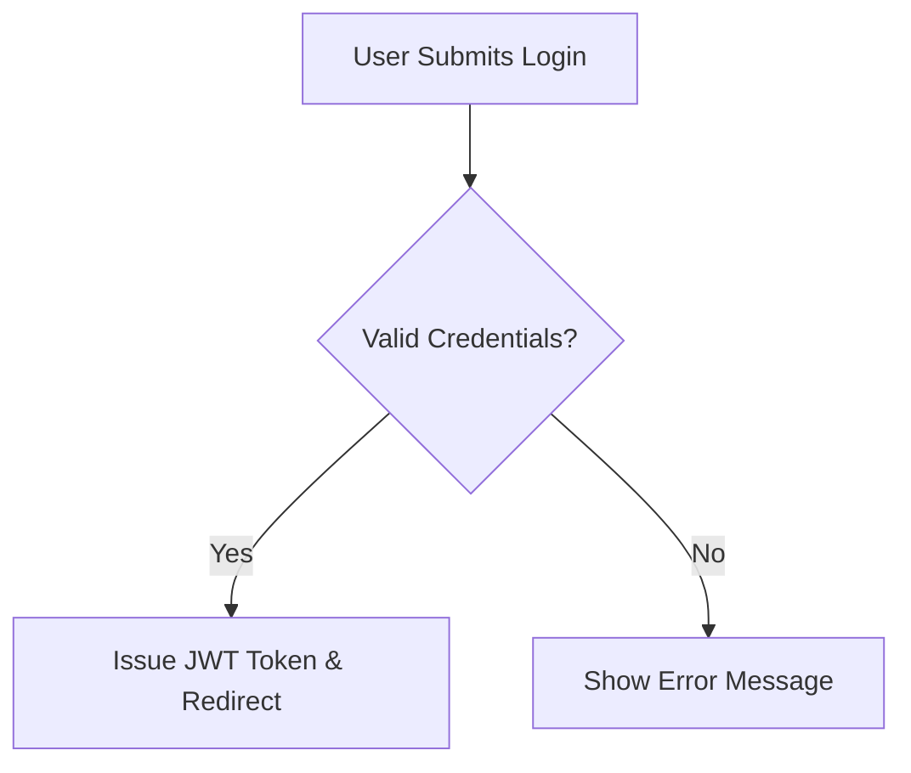

# Format Content and Charts

- Source: https://help.atoms.dev/en/articles/12129489-content-formatting-guide
- Summary: Guide on using Markdown formatting and rendering interactive Mermaid flowcharts
- Updated: Jul 29, 2026

---

Learn how to format text with Markdown and render interactive Mermaid diagrams in Atoms.

## Displaying Formatted Markdown Content

Atoms natively supports Markdown formatting in chat responses, documentation, and rendered views.

### Supported Markdown Elements

- **Headers**: Use `#`, `##`, or `###` for structured section headings.
- **Emphasis**: Use `**bold**` or `*italic*` text.
- **Lists**: Use `-` or `1.` for bulleted and numbered lists.
- **Code Blocks**: Wrap code snippets in triple backticks (```) with language syntax highlighting.

To request formatted output, simply instruct your AI Agent:
- *"Please format your response in clear Markdown with subheadings and bullet points."*

---

## Displaying & Rendering Mermaid Charts

Atoms supports rendering flowcharts, sequence diagrams, and architecture maps using **Mermaid.js**.

### How to Generate Mermaid Charts

Prompt your AI Agent to produce a Mermaid diagram:
- *"Generate a Mermaid flowchart illustrating the user authentication lifecycle."*

Your agent will output a standard Mermaid code block:



Atoms automatically parses this block and renders it as an interactive visual diagram in your view.
